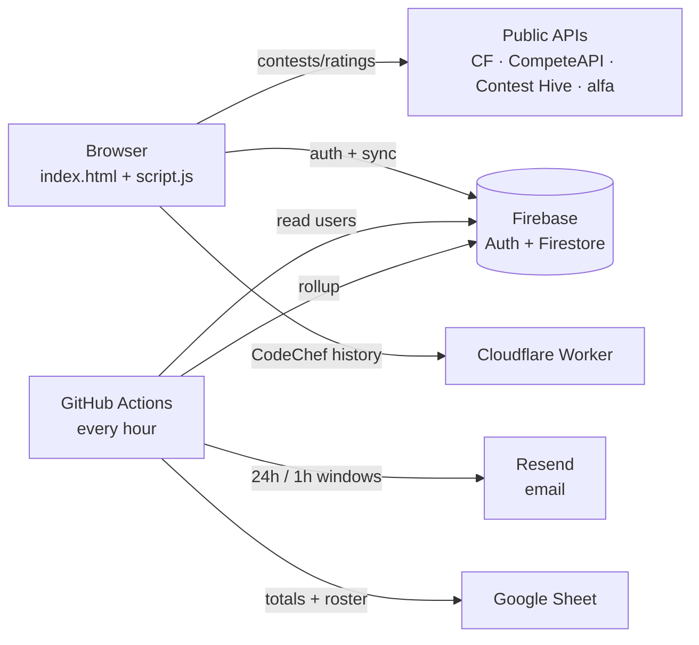

<div align="center">

#  ContestRadar

### Every Codeforces, LeetCode, CodeChef & AtCoder contest - tracked, analyzed, reminded.

[](https://contest-radar.netlify.app)


*ContestRadar started life as a [Lively Wallpaper](https://github.com/rocksdanister/lively) desktop widget. It grew up into a full product - accounts, cross-device sync, per-platform rating analytics, and real email reminders - while the same files still run as your wallpaper.*

</div>

---

##  Features

<table>
<tr><td> <b>Contests</b></td><td>Merged upcoming schedule from all four platforms - live badges (<code>LIVE · Join now</code> / <code>LIVE · Virtual only</code> for late CF rounds), countdowns, search, platform + live filters, CF rating-based eligibility</td></tr>
<tr><td> <b>Accounts</b></td><td>Google Sign-In only. Link CF / LeetCode / AtCoder / CodeChef handles once - synced to Firestore, restored on any device. Platform handles carry a 30-day change cooldown, enforced in security rules</td></tr>
<tr><td> <b>Analytics</b></td><td>Per-platform rating graphs with hover tooltips, animated count-up stats, morphing curves, rank-colored CURRENT (CF / LC / AtCoder / CodeChef palettes), streaks, tier placement, history tables, insights, CSV export</td></tr>
<tr><td> <b>Reminders</b></td><td>Star to track, ring the bell to subscribe - cron emails you 24h + 1h before, with per-contest opt-out, global kill-switch, and dedupe markers</td></tr>
<tr><td> <b>Themes</b></td><td>Dark / Light / System (OS-following), persisted per account, zero flash</td></tr>
<tr><td> <b>Founder stats</b></td><td>Hourly rollup to Firestore <code>stats/latest</code> + per-user roster CSV artifact + auto-updating Google Sheet (totals log + per-user roster)</td></tr>
</table>

---

## 🖥️ Screenshots


---

##  Architecture

No servers. A static frontend + Backend-as-a-Service + two serverless jobs:



| Piece | Role |
|---|---|---|
| Static site (Netlify / Vercel / Pages) | Everything the user sees |
| Firebase Auth + Firestore | Google login, per-user docs, owner-only rules |
| Cloudflare Worker | CodeChef rating history proxy (public profile → JSON) |
| GitHub Actions cron | Reminder emails, stats rollup, roster CSV, Sheet push |
| Resend | Transactional email (`ContestRadar <onboarding@resend.dev>`) |

---

##  Getting started

### Run it locally

```powershell
npx serve -l 3000   # then open http://localhost:3000
```

> Google sign-in requires `http(s)` - it will not work over `file://`. `localhost` is pre-authorized by Firebase.

### Wire your own backend (5 steps)

1. **Firebase**: create project → enable **Google** provider (Authentication) → create **Firestore** (`asia-south1`, production mode) → paste the [rules](docs/firestore.rules) (owner-only docs + 30-day handle cooldown) → register a Web app → copy `firebaseConfig` into [`firebase-init.js`](firebase-init.js).
2. **CodeChef Worker**: paste [`docs/codechef-worker.js`](docs/codechef-worker.js) into a Cloudflare Worker → set `CC_PROXY_URL` in [`script.js`](script.js).
3. **Reminders**: [Resend](https://resend.com) API key → repo secrets `RESEND_API_KEY` + `FIREBASE_SERVICE_ACCOUNT` (+ optional `SHEETS_ID`) → the [`reminders`](.github/workflows/reminders.yml) workflow runs hourly; dispatch manually with `test_email` to verify.
4. **Sheet (optional)**: enable Google Sheets API → share a sheet with the service-account email → `SHEETS_ID` secret → hourly `log` + `roster` tabs fill themselves.
5. **Deploy**: push to `master` - Netlify/Vercel/Cloudflare Pages all serve it with zero config. Add the production domain to Firebase **Authorized domains** or login breaks in prod.

### Project structure

```
├── index.html                 # app shell: nav, 3 views, modals, footer
├── style.css                  # dark/light themes, cards, chart tooltip, motion
├── script.js                  # contests, accounts, analytics, reminders UI (~100 fns)
├── firebase-init.js           # Firebase bootstrap (fails soft to local-only)
├── about.html / privacy.html  # themed standalone pages (own header/footer)
├── vercel.json                # security headers (nosniff, DENY framing, …)
├── LivelyInfo.json            # the same files double as a Lively wallpaper
├── reminders/
│   ├── send.js                # cron: windows, dedupe, stats, roster CSV, sheet push
│   └── package.json           # firebase-admin + googleapis
└── .github/workflows/
    └── reminders.yml          # hourly cron + manual dispatch (test / CSV export)
```

Secrets live **only** in consoles (never in code): `RESEND_API_KEY`, `FIREBASE_SERVICE_ACCOUNT`, `SHEETS_ID`. The Firebase `apiKey` in [`firebase-init.js`](firebase-init.js) is public by design - the security boundary is Firestore rules + authorized domains, not the key.

---

## 📡 Data sources

| Feed | Source | Notes |
|---|---|---|
| CF contests + ratings | Official Codeforces API | `contest.list`, `user.info`, `user.rating` |
| LC / CC contests | CompeteAPI mirror | Community-run, cached fallback built in |
| AtCoder contests | Contest Hive mirror | Filtered to ABC / ARC / AGC |
| LC ratings | alfa LeetCode API | Full contest history + badges |
| AtCoder history | Public history feed (reader mirror fallback) | CORS-blocked direct, proxied |
| CC history | Own Cloudflare Worker | Scrapes public profile `all_rating`; mirror fallback |

---

## Security model

- Per-user Firestore rules (`request.auth.uid == uid`) + 30-day handle-change cooldown enforced **server-side** (timestamps, grace window, legacy-safe)
- Google-only auth - no passwords to leak or migrate; OAuth identities are provider-portable
- Reminder recipients resolved from Firebase Auth, never from writable docs (no inbox-spoofing via own profile)
- Contest URLs gated to `http(s)` (community feeds are untrusted input); all renders escaped; secrets never in code, logs, or chat

---

## Roadmap

- [ ] Push notifications (FCM) alongside email
- [ ] Leaderboards + verified-handle badges
- [ ] PWA installability + offline mode
- [ ] Recommendation insights ("what to fix next")
- [ ] Test suite around feed parsers (one format change breaks silently today)

---

## Acknowledgements

- [Lively Wallpaper](https://github.com/rocksdanister/lively) - where this started initially
- Codeforces, LeetCode, CodeChef, AtCoder - for the contests
- CompeteAPI, Contest Hive, alfa API - community data feeds
- Firebase, Cloudflare, Resend, GitHub Actions - free tiers carrying a real product

---

<div align="center">

© 2026 ContestRadar · Built by **Vansh Maheshwari**

</div>
